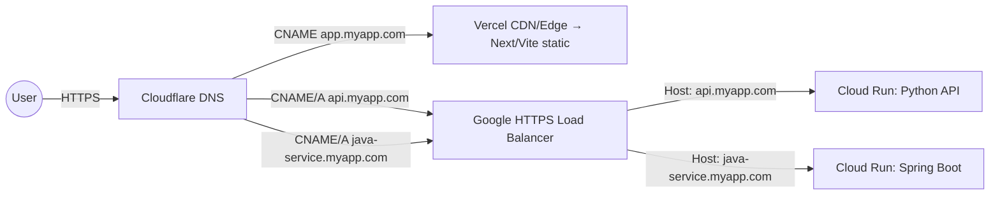

# Serverless Production Deployment Playbook (SaaS on Custom Domain)

A complete, practical guide to deploy a full‑stack (React/Next/Vite + Python API + Java Spring Boot) to a single custom domain with subdomains, autoscaling, HTTPS, and CI/CD using **Cloudflare DNS**, **Vercel** (frontend), and **Google Cloud Run** (APIs/services).

> **Audience:** Skilled devs new to deployment & domains.\
> **Goals:** Cost‑effective, serverless/PaaS, autoscaling, minimal maintenance, push‑to‑deploy.

---

## 0) TL;DR Quick Start

1. **Register domain** at Cloudflare Registrar → manage DNS in Cloudflare.
2. **Frontend** → Vercel: import GitHub repo → add `app.myapp.com` domain → follow CNAME instructions.
3. **APIs (Python & Java)** → Google Cloud Run: containerize, deploy each service.
4. **HTTPS Load Balancer (GCP)** → host‑based routing: `api.myapp.com` → Python, `java-service.myapp.com` → Java.
5. **DNS** in Cloudflare: CNAME/A to Vercel & GCP LB.
6. **CI/CD** with GitHub Actions using OIDC to GCP + optional Vercel CLI.

---

## 1) Domain & DNS Basics

### Recommended registrar & DNS

- **Cloudflare Registrar + Cloudflare DNS (Free)**: at‑cost domains, fast anycast DNS, simple UI, free SSL/WAF if proxied.

### Records you will use

- **A / AAAA:** map name → IPv4/IPv6 (often apex).
- **CNAME:** alias name → another host (ideal for subdomains).
- **ALIAS/Flattening:** CNAME‑like at apex (CF auto‑flattens).
- **MX:** mail exchanger (only if you set up email).

### Registration steps

1. Create Cloudflare account → **Register** `myapp.com`.
2. Open **DNS** tab → add records when platforms (Vercel/GCP) show you exact targets.
3. During cert issuance, keep CF **Proxy: DNS only**; you can switch proxy **ON** later if you want CF security/caching.

---

## 2) Architecture Options (Choose One)

> **Recommended:** **Vercel (frontend) + Cloud Run (APIs) + Cloudflare DNS**

### Option A — Vercel + Cloud Run (Recommended)

- **Frontend:** Vercel CDN/Edge, free custom domain & SSL, great DX.
- **APIs:** Cloud Run: serverless containers for Python & Java, scale to zero, generous free tier.
- **Domains:** Vercel manages SSL for `app.myapp.com`; GCP LB manages SSL for `api.myapp.com`, `java-service.myapp.com`.

### Option B — All‑in GCP

- Cloud Domains + Cloud DNS + Cloud Run + HTTPS LB (+ optional Cloud CDN). Single‑cloud governance, one bill.

### Option C — All‑in AWS

- S3 + CloudFront (frontend), ECS/Fargate or Lambda (APIs), Route 53, ACM certs. Powerful but more config.

### Trade‑off summary

| Option             | Pros                                                         | Cons                                  | Best for                          |
| ------------------ | ------------------------------------------------------------ | ------------------------------------- | --------------------------------- |
| Vercel + Cloud Run | Easiest DX, low cost, perfect for Next/Vite + mixed backends | Two providers; LB setup for APIs      | Most modern SaaS with minimal ops |
| GCP‑only           | Single provider, clean IAM                                   | Slightly more steps for frontend      | Teams preferring one‑cloud        |
| AWS‑only           | Enterprise networking, CloudFront FT                         | Higher learning curve for low traffic | AWS‑savvy teams                   |

---

## 3) Reference Diagram (Mermaid)



---

## 4) Deploy Each Service

### 4.1 Frontend (React/Next/Vite) → Vercel

1. Push code to GitHub.
2. In Vercel, **Import Project** from GitHub → framework auto‑detected → **Deploy**.
3. Add custom domain `app.myapp.com` in Project → **Settings → Domains**.
4. Vercel shows a **CNAME** target; add it in Cloudflare DNS.
5. Wait until status shows **Ready** (SSL provisioned).

**Build scripts** (example `package.json`):

```json
{
  "scripts": {
    "build": "next build && next export",
    "start": "next start"
  }
}
```

(*Use framework defaults; Vercel auto‑builds*)

---

### 4.2 Python API (FastAPI/Flask) → Cloud Run (Container)

**Dockerfile (lean production):**

```dockerfile
FROM python:3.11-slim AS build
WORKDIR /app
COPY pyproject.toml poetry.lock* requirements.txt* ./
RUN pip install -U pip && (pip install -r requirements.txt || true)
COPY . .
RUN pip install -e .

FROM gcr.io/distroless/python3-debian12
WORKDIR /app
COPY --from=build /usr/local/lib/python3.11 /usr/local/lib/python3.11
COPY --from=build /usr/local/bin/uvicorn /usr/local/bin/uvicorn
COPY --from=build /app /app
ENV PORT=8080
CMD ["/usr/local/bin/uvicorn","app:app","--host","0.0.0.0","--port","8080","--proxy-headers"]
```

**Deploy (one‑time manual):**

```bash
# Create GCP project, enable Artifact Registry + Cloud Run
REGION=europe-west6   # pick near CH (Zurich)
PROJECT=your-gcp-project
REPO=containers

gcloud artifacts repositories create $REPO \
  --repository-format=docker --location=$REGION

gcloud auth configure-docker $REGION-docker.pkg.dev

docker build -t $REGION-docker.pkg.dev/$PROJECT/$REPO/api:initial ./api

docker push $REGION-docker.pkg.dev/$PROJECT/$REPO/api:initial

gcloud run deploy api \
  --image $REGION-docker.pkg.dev/$PROJECT/$REPO/api:initial \
  --region $REGION --allow-unauthenticated \
  --memory=512Mi --cpu=1 --concurrency=80
```

**Tuning:** set `min-instances=0` (scale to zero) or `>0` to reduce cold starts.

---

### 4.3 Java Service (Spring Boot) → Cloud Run (with Jib)

\`\`\*\* plugin:\*\*

```xml
<plugin>
  <groupId>com.google.cloud.tools</groupId>
  <artifactId>jib-maven-plugin</artifactId>
  <version>3.4.6</version>
  <configuration>
    <to>
      <image>${region}-docker.pkg.dev/${project}/${repo}/java-service:latest</image>
    </to>
    <from>
      <image>gcr.io/distroless/java17-debian12</image>
    </from>
    <container>
      <jvmFlags>
        <jvmFlag>-Xms256m</jvmFlag>
        <jvmFlag>-Xmx512m</jvmFlag>
      </jvmFlags>
      <ports><port>8080</port></ports>
    </container>
  </configuration>
</plugin>
```

**Deploy:**

```bash
REGION=europe-west6
PROJECT=your-gcp-project
REPO=containers

gcloud auth configure-docker $REGION-docker.pkg.dev

mvn -B -DskipTests clean compile \
  com.google.cloud.tools:jib-maven-plugin:build \
  -Djib.to.image=$REGION-docker.pkg.dev/$PROJECT/$REPO/java-service:$(git rev-parse --short HEAD)

gcloud run deploy java-service \
  --image $REGION-docker.pkg.dev/$PROJECT/$REPO/java-service:$(git rev-parse --short HEAD) \
  --region $REGION --allow-unauthenticated \
  --memory=1Gi --cpu=1 --concurrency=80
```

**Note:** Use `min-instances=0` for lowest cost; increase if latency matters.

---

## 5) Custom Domains & HTTPS (Production)

### 5.1 Frontend on Vercel (`app.myapp.com`)

- Vercel → Project → **Settings → Domains** → add `app.myapp.com`.
- Copy the **CNAME** value it shows, add that in Cloudflare DNS.
- SSL is automatic.

### 5.2 APIs on Cloud Run (`api.myapp.com`, `java-service.myapp.com`)

**Recommended: Google HTTPS Load Balancer** with **Serverless NEGs**

1. Create **serverless NEG** for each Cloud Run service.
2. Create **URL map** with **host rules**:
   - `api.myapp.com` → NEG: `api`
   - `java-service.myapp.com` → NEG: `java-service`
3. Create **managed SSL cert** on the LB for both hostnames.
4. Reserve a **global static IP** (optional) and attach to LB frontend.
5. In Cloudflare DNS add:
   - `api` → **CNAME** pointing to LB hostname **or** **A/AAAA** to LB IP.
   - `java-service` similarly.
6. Keep CF proxy **DNS only** until certs are **Active**, then enable proxy if desired.

**Budget shortcut:** Cloud Run direct domain mapping (works; LB is more robust at scale).

---

## 6) CI/CD with GitHub Actions

### 6.1 Frontend → Vercel (CLI variant)

```yaml
# .github/workflows/frontend.yml
name: Frontend Deploy
on:
  push:
    branches: [ main ]
    paths: [ "frontend/**" ]

jobs:
  deploy:
    runs-on: ubuntu-latest
    steps:
      - uses: actions/checkout@v4
      - uses: actions/setup-node@v4
        with: { node-version: 20 }
      - run: npm ci
        working-directory: frontend
      - run: npm run build
        working-directory: frontend
      - name: Deploy to Vercel
        run: npx vercel deploy --cwd frontend --prod --yes --token ${{ secrets.VERCEL_TOKEN }}
```

### 6.2 Python API → Cloud Run (OIDC, no JSON keys)

```yaml
# .github/workflows/api.yml
name: API Deploy
on:
  push:
    branches: [ main ]
    paths: [ "api/**", ".github/workflows/api.yml" ]

jobs:
  deploy:
    permissions:
      id-token: write
      contents: read
    runs-on: ubuntu-latest
    steps:
      - uses: actions/checkout@v4
      - id: auth
        uses: google-github-actions/auth@v2
        with:
          workload_identity_provider: ${{ secrets.GCP_WORKLOAD_IDP }}
          service_account: ${{ secrets.GCP_SA_EMAIL }}
      - uses: google-github-actions/setup-gcloud@v2
        with:
          project_id: ${{ secrets.GCP_PROJECT }}
      - name: Build & Push
        run: |
          gcloud auth configure-docker ${{ secrets.GCP_REGION }}-docker.pkg.dev
          docker build -t ${{ secrets.GCP_REGION }}-docker.pkg.dev/${{ secrets.GCP_PROJECT }}/${{ secrets.GCP_REPO }}/api:${{ github.sha }} ./api
          docker push  ${{ secrets.GCP_REGION }}-docker.pkg.dev/${{ secrets.GCP_PROJECT }}/${{ secrets.GCP_REPO }}/api:${{ github.sha }}
      - name: Deploy
        uses: google-github-actions/deploy-cloudrun@v2
        with:
          service: api
          image: ${{ secrets.GCP_REGION }}-docker.pkg.dev/${{ secrets.GCP_PROJECT }}/${{ secrets.GCP_REPO }}/api:${{ github.sha }}
          region: ${{ secrets.GCP_REGION }}
          allow_unauthenticated: true
```

### 6.3 Java Service → Cloud Run (Jib + OIDC)

```yaml
# .github/workflows/java.yml
name: Java Service Deploy
on:
  push:
    branches: [ main ]
    paths: [ "java-service/**", ".github/workflows/java.yml" ]

jobs:
  deploy:
    permissions:
      id-token: write
      contents: read
    runs-on: ubuntu-latest
    steps:
      - uses: actions/checkout@v4
      - uses: actions/setup-java@v4
        with:
          distribution: temurin
          java-version: '21'
      - uses: google-github-actions/auth@v2
        with:
          workload_identity_provider: ${{ secrets.GCP_WORKLOAD_IDP }}
          service_account: ${{ secrets.GCP_SA_EMAIL }}
      - uses: google-github-actions/setup-gcloud@v2
        with:
          project_id: ${{ secrets.GCP_PROJECT }}
      - name: Configure Artifact Registry
        run: gcloud auth configure-docker ${{ secrets.GCP_REGION }}-docker.pkg.dev
      - name: Build & Push with Jib
        working-directory: java-service
        run: |
          mvn -B -DskipTests clean compile \
            com.google.cloud.tools:jib-maven-plugin:build \
            -Djib.to.image=${{ secrets.GCP_REGION }}-docker.pkg.dev/${{ secrets.GCP_PROJECT }}/${{ secrets.GCP_REPO }}/java-service:${{ github.sha }}
      - name: Deploy to Cloud Run
        uses: google-github-actions/deploy-cloudrun@v2
        with:
          service: java-service
          image: ${{ secrets.GCP_REGION }}-docker.pkg.dev/${{ secrets.GCP_PROJECT }}/${{ secrets.GCP_REPO }}/java-service:${{ github.sha }}
          region: ${{ secrets.GCP_REGION }}
          allow_unauthenticated: true
```

### 6.4 Required GitHub Secrets (all workflows)

- `VERCEL_TOKEN` (frontend CLI; skip if using native Vercel‑GitHub integration)
- `GCP_PROJECT`, `GCP_REGION`, `GCP_REPO`
- `GCP_WORKLOAD_IDP` (Workload Identity Provider full resource name)
- `GCP_SA_EMAIL` (deployer service account email)

> **Set up OIDC once:** create a Workload Identity Pool + Provider, a deployer SA (`roles/run.admin`, `roles/artifactregistry.writer`), and map your GitHub repo.

---

## 7) Cost & Scaling Cheatsheet

- **Cloudflare Registrar/DNS:** \~CHF/EUR 8–12/yr for the domain; DNS free.
- **Vercel (Hobby):** free with custom domain + SSL; upgrade as needed.
- **Cloud Run:** generous free tier; pay per request/CPU/GB‑sec beyond free.
- **GCP HTTPS LB:** a few CHF/USD/month when enabled; worth it for production routing/SSL.

**Scaling knobs:**

- Cloud Run: `concurrency`, `min-instances`, `max-instances`.
- Java cold starts: set a small `min-instances` if latency matters.
- Frontend: Vercel edge cache scales globally by default.

---

## 8) Day‑1 Copy‑Paste Checklist

-

---

## 9) Troubleshooting

- **SSL stuck “Pending”:** set Cloudflare **Proxy: DNS only** for the hostname until cert status is Active.
- **404 from LB:** check URL map host rules and path matchers; confirm NEG backends healthy.
- **Cold starts:** raise Cloud Run `min-instances` (small cost).
- **Image push fails:** run `gcloud auth configure-docker <region>-docker.pkg.dev`.
- **Vercel domain not ready:** re-check exact CNAME host and value; wait for DNS propagation.

---

## 10) Next Steps (Optional Hardening)

- Add **Cloud SQL** or **Firestore** (managed DB).
- Add **Secret Manager** for API keys; mount as env vars.
- Enable **Cloud Logging/Monitoring** + alerts.
- Add **Cloud CDN** in front of the LB for API caching if helpful.
- Zero‑trust: restrict internal admin routes via Identity‑Aware Proxy (IAP).

---

**End of Playbook** — Keep this as your living SOP. Update with your real project/region IDs and you’re production‑ready.

